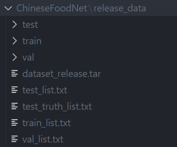

# Chinese traditional food picture classification

主要功能为使用Resnet50在ChineseFoodNet上进行训练，搭建分类网络。

## Specific implementation

1. 实现了使用Resnet50训练，并达到测试集与验证集上top1 70%，top5 90%的精度。
2. 模型具有保存和读取功能。
3. 添加了计算top1和top5 accuracy的函数，可计算train，test，valid等数据集上的准确率

## About ChineseFoodNet

这个是一个关于中国传统食物图片的数据集。其中包含了208类食物，数据集图片总量大小约20G，数量约18W，关于数据集的详细描述可以参见[ChineseFoodNet](https://sites.google.com/view/chinesefoodnet/)。

## Usage

PyTorch实现版本为1.8.1。

1.将数据集下载到ChineseFoodNet文件夹：

数据集下载：
https://pan.baidu.com/s/19lPkSGhMwe5QLLXHNOu-Zw?pwd=7rur

2.项目根目录创建model_data文件夹，权重放入model_data文件夹下。

训练权重下载：
链接: https://pan.baidu.com/s/1szYn5OTT01eNCkwr2fWTQA?pwd=w2uj

此权重实现效果：
训练集train
Top 1 Accuracy: 97.28%, Top 5 Accuracy: 99.83%
验证集valid
Top 1 Accuracy: 68.76%, Top 5 Accuracy: 90.95%
测试集test
Top 1 Accuracy: 68.93%, Top 5 Accuracy: 91.09%

3.cal_top5acc.py ，cal_top1acc.py 可切换验证集，测试集。修改dataset_test即可。

# References

- Chen X, Zhu Y, Zhou H, et al. Chinesefoodnet: A large-scale image dataset for chinese food recognition[J]. arXiv preprint arXiv:1705.02743, 2017.
- He K, Zhang X, Ren S, et al. Deep residual learning for image recognition[C]//Proceedings of the IEEE conference on computer vision and pattern recognition. 2016: 770-778.
- https://github.com/paradiseDust/ChineseFoodNet-EffiNet-L2
