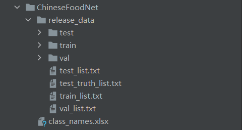

# README

>本项目基于https://github.com/paradiseDust/ChineseFoodNet-EffiNet-L2

## 本人对项目的补充和改进

1. 实现了使用Resnet50训练ChineseFoodNet，并达到测试集与验证集上top1 70%，top5 90%的精度。
2. 对原代码进行修补，增加了模型的保存和读取功能。
3. 添加了计算top1和top5 accuracy的函数，可计算train，test，valid等数据集上的准确率

下载训练权重：
链接：https://pan.baidu.com/s/1m4IvWSB74BATBhwR78ZDtw?pwd=89d3 
提取码：89d3
放到model_data文件夹下

此权重实现效果：
训练集train
Top 1 Accuracy: 97.28%, Top 5 Accuracy: 99.83%
验证集valid
Top 1 Accuracy: 68.76%, Top 5 Accuracy: 90.95%
测试集test
Top 1 Accuracy: 68.93%, Top 5 Accuracy: 91.09%

## 1 Background

该仓库主要完成了对数据集ChineseFoodNet的数据集类的PyTorch版本的编写，有助于各种深度学习框架快速训练。

并且使用EffiNet-L2(SAM)完成了对食物的208类分类网络的搭建。

## 2 ****ChineseFoodNet****

这个是一个关于中国传统食物图片的数据集。其中包含了208类食物，数据集图片总量大小约20G，数量约18W，关于数据集的详细描述可以参见[ChineseFoodNet](https://sites.google.com/view/chinesefoodnet/)。

该数据集作者声明可做公开学术交流，由于数据集过大，仓库不上传该数据集，仅提供下载连接，供有需要的下载学习。

1. 图片数据：
- [https://pan.baidu.com/s/1EgaDwWOfJVmBQ_JWO64_4Q](https://pan.baidu.com/s/1EgaDwWOfJVmBQ_JWO64_4Q)
    - 提取码：4ma7
1. 标签数据：
- [https://pan.baidu.com/s/19xGMtIHiAZDOKajLfLLlfQ](https://pan.baidu.com/s/19xGMtIHiAZDOKajLfLLlfQ)
    - 提取码：16pb

## 3 Usage&Install

该版本的代码由PyTorch实现，版本为1.8.1。

配置好环境后，需要将数据集下载到ChineseFoodNet文件夹，按照下图的文件目录组织即可：

## 4 Notice

- 项目仅作为学习交流使用
- 有任何问题可以留言